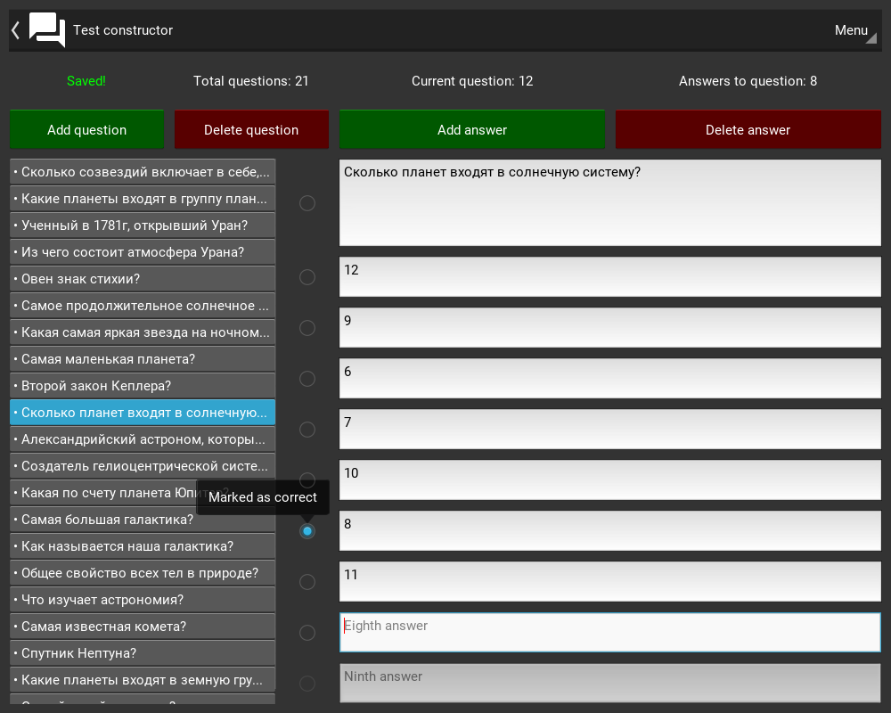
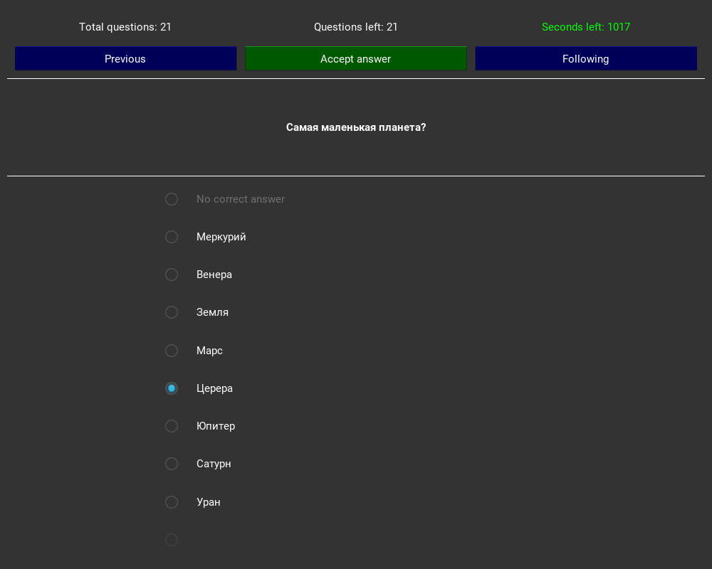

# Test constructor
Application for creating and passing tests

## Requirements
- Python >= 3.6
- Kivy >= 1.10
- [Widgets KV](https://github.com/Paduct/widgets_kv)

## Installation
```shell
git clone https://github.com/Paduct/test_constructor
```

## Usage
### with GUI
```shell
python test_constructor
```
```shell
python test_constructor/src/tester.py
```

## Screenshot


